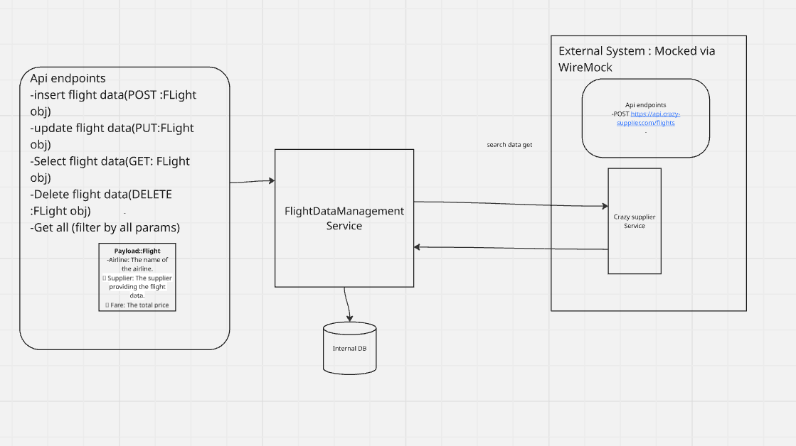
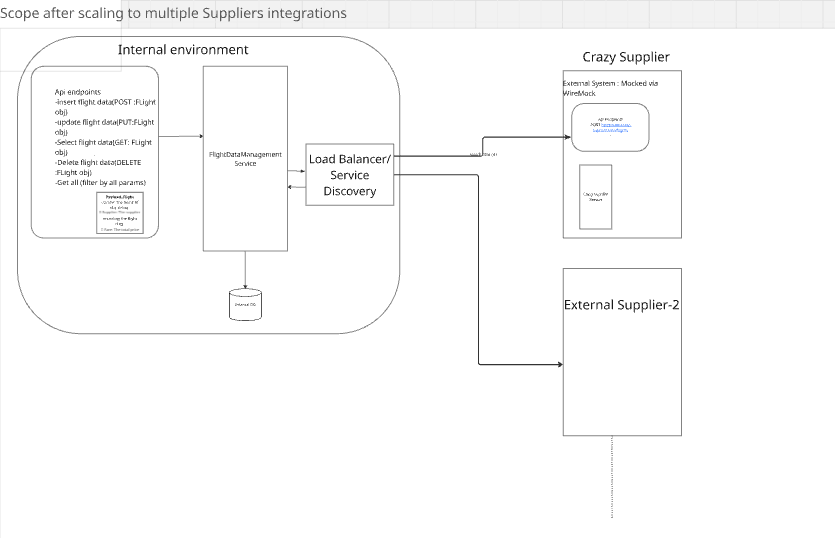

# FlightDataManagement
Flight Data Management Application

Assumptions:
1. The endpoint for CrazySupplier though it is POST we have to get the data using that
As it is the only endpoint available to us.
2. Since we cannot save the data any data from crazy supplier is not present in our database (no supplier ID present in our DB)
3. If the duplicate flight info found with another supplier Id in inter database and response from supplier will show both assuming both are unique.
4. Since CrazySupplier is only responsible for supplying data for now will only send hardcoded data .
5. Inbound and outbound date can be same or different.

Implementation:
1. Earlier designed Eureka server and 2 client including CrazySupplier service and FLightDataManagement Service
however , as we only need data from CrazySupplier I have mocked it using wireMock.

Components:
1. Single service with 5 endpoints
2.  /search endpoint for crazySupplier data.
3. Tested using unit tests
4. Integration test Postman collection attached
5. Exception Handler
6. Used Swagger for validation and Jackson for mapping.
7. Wiremock folder contains mocked data from crazySupplier.
8. Not added any security features and other components like rate limiter as currently only 1 service is integrated.
9. The second diagram when more than more suppliers are integrated.

